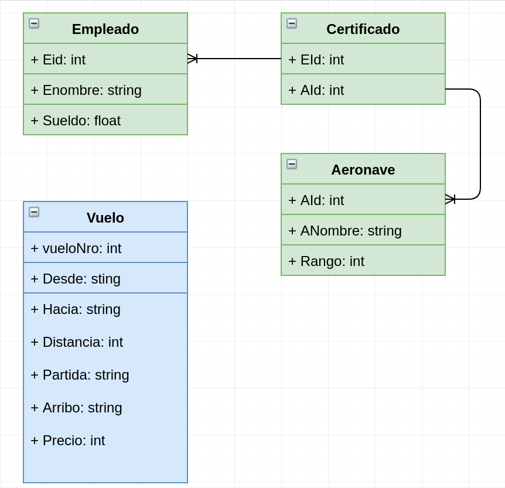

# Ejercicio-python
Examen desarrollo ISBA - Java &amp; Python

## Ejercicio 1 => test-iterator

- Dé un ejemplo de una situación que requiera el uso de ThreadLocal.

    Podemos usar esta clase para evitar incluir en cada método el parámetro de ese dato si es usado en multitud de métodos simplificando en gran medida el código. En las aplicaciones web este dato puede ser el usuario que se ha autenticado, el dominio por el que se ha accedido a la aplicación, el dispositivo móvil, el idioma del usuario o cualquier otra información que queramos esté disponible de forma global en el hilo de ejecución.

- ¿Cuándo es necesario marcar una variable como volatile?

    Sirve para marcar una variable que es compartida por varios hilos, indicando que le valor de esta variable puede cambiar en cualquier momento y debe ser visible por todos los hilos que la usen.

- ¿Qué lleva a una situación de deadlock? ¿Cómo puede resolverse?

    - Se da cuando dos o mas hilos, se bloquean mutuamente esperandose el uno al otro. Luego de analizar el funcionamiento y detectar el problema, se puede optar por reordenar la logica y el acceso a los recursos compartidos.

## Sean los siguientes esquemas relacionales:

Vuelo(VueloNro, Desde, Hacia, Distancia, Partida, Arribo, Precio)
Aeronave(AId, ANombre, Rango)
Certificado(EId, AId)
Empleado(EId, Enombre, Sueldo)

La relación Empleado contiene datos de todos los empleados de la compañía, entre ellos los pilotos.
En la relación Certificado solo figuran los pilotos certificados para volar una determinada aeronave.

Responder la siguiente consulta en SQL:

“Listar los nombres de los pilotos que pueden volar 
aeronaves con rango de crucero mayor a 5000 millas 
pero que solo está certificado con aviones Boeing”

SELECT Enombre AS 'Nombre' 
FROM Empleados E 
JOIN Certificado C 
ON E.EId = C.EId
JOIN Aeronave A 
ON A.AId = C.AId 
WHERE A.Rango > 5000 
AND A.ANombre LIKE '%Boeing%'

## Python => python_test

## Yapa vehicle_manager
Es el ejercicio de python con Django.

        virtualenv entorno-prueba --python=python3
        source entorno-prueba/bin/activate
        cd vehicle_manager
        pip install -r requirementrs.txt
        python manage.py runserver

